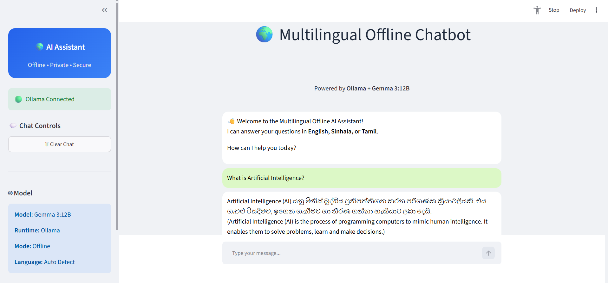

# 🌍 Multilingual Offline AI Chatbot

A multilingual AI chatbot built with **Streamlit** and **Ollama** that runs entirely offline using the **Gemma 3:12B** large language model.

The chatbot automatically detects the user's language and responds in **English**, **Sinhala**, or **Tamil** without requiring an internet connection.

---



## 🚀 Features

- 🌍 Automatic language detection
- 🇬🇧 English support
- 🇱🇰 Sinhala support
- 🇮🇳 Tamil support
- 🔒 Completely offline
- ⚡ Powered by Ollama
- 🤖 Uses Gemma 3:12B
- 💬 Chat history memory
- 🧹 Clear chat functionality
- 🎨 Modern Streamlit interface

---

## 📁 Project Structure

```
offline-chatbot/
│
├── app.py              # Main application
├── config.py           # Page configuration & system prompt
├── session.py          # Session state initialization
├── styles.py           # Custom CSS styling
├── sidebar.py          # Sidebar UI
├── chat.py             # Chat interface
├── chatbot.py          # Ollama response generation
├── requirements.txt
└── README.md
```

---

## 🛠 Requirements

- Python 3.10 or later
- Ollama installed
- Gemma 3:12B model

---

## 📦 Installation

### 1. Clone the repository

```bash
git clone https://github.com/yourusername/offline-chatbot.git

cd offline-chatbot
```

---

### 2. Create a virtual environment (Optional)

Windows

```bash
python -m venv .venv

.venv\Scripts\activate
```

Linux / macOS

```bash
python3 -m venv .venv

source .venv/bin/activate
```

---

### 3. Install dependencies

```bash
pip install -r requirements.txt
```

---

### 4. Install Ollama

Download and install Ollama from

https://ollama.com

---

### 5. Download the Gemma model

```bash
ollama pull gemma3:12b
```

---

### 6. Start the Ollama server

```bash
ollama serve
```

---

### 7. Run the application

```bash
streamlit run app.py
```

The chatbot will open automatically in your browser.

---

## 💬 Example Questions

### English

- What is Artificial Intelligence?
- Explain Machine Learning.
- What is Python?
- Who invented the computer?

### Sinhala

- කෘතිම බුද්ධිය යනු කුමක්ද?
- ශ්‍රී ලංකාවේ අගනුවර කුමක්ද?

### Tamil

- செயற்கை நுண்ணறிவு என்றால் என்ன?
- இந்தியாவின் தலைநகர் என்ன?

---

## ⚙️ Technologies Used

- Python
- Streamlit
- Ollama
- Gemma 3:12B

---

## 🔮 Future Improvements

- Voice input
- Speech output
- File upload support
- Image understanding
- Conversation export
- Dark/Light mode
- Multiple AI model selection
- Streaming responses

---

## 📄 License

This project is licensed under the MIT License.

---

## 👩‍💻 Author

**Sanjula Sri Jayani**

Computer Engineering Undergraduate

General Sir John Kotelawala Defence University (KDU)

Sri Lanka
